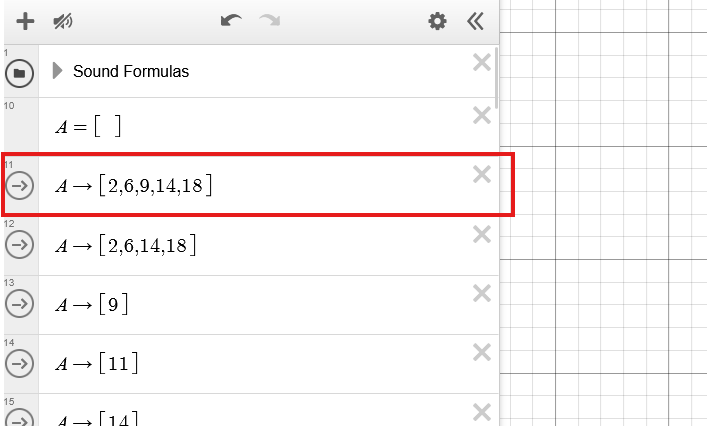

# MIDI Player

> A Rust-based CLI tool for converting MIDI files into formulas and inputs for Desmos.

## Installation

To use the MIDI Player, you must have [Rust](https://www.rust-lang.org/tools/install) installed on your system. Clone this repository and build the project:

```bash
git clone https://github.com/ruelalarcon/desmos_music.git
cd desmos_music
```

## Usage

First, navigate to this [Desmos graph](https://www.desmos.com/calculator/zmrpkgga74), and enable audio through the button in the top left:


The MIDI Player has two main commands:

```bash
# Export a MIDI file
./export.bat <midi_file>    # Windows
./export.sh <midi_file>     # Linux/Mac

# Play a converted song
./play.bat <song_folder>    # Windows
./play.sh <song_folder>     # Linux/Mac
```

- `<midi_file>`: Path to the input MIDI file to convert
- `<song_folder>`: Path to a folder containing the converted song data, when exported, this will be given the same name as the MIDI file without the file extension

### Usage Examples

Convert a MIDI file to playable format:
```bash
./export.bat song.mid # Use export.sh instead of export.bat for Linux/Mac
```

The first time this is run, it will install all the necessary Rust dependencies before exporting the song.

This will create a folder named `song`. Inside it, open `formulas.txt` in a text editor to view the Desmos formulas, and simply copy paste them into a Desmos formula box. This should paste a bunch of formulas into desmos. Scroll to the top until you can see the first formula/box with an arrow to its left:



Now, play your converted song using:
```bash
./play.bat song
```

You should now have three seconds to select that first box, simply by clicking on it. After three seconds, the song will begin playing. If you find that three seconds is too short, you can change the `initial_delay` in the `config.toml` file to a larger number.

### Configuration

The program uses a `config.toml` file to customize keyboard inputs and timing:

```toml
[keyboard]
stop_key = "f"                            # Key to stop playback
start_sequence = ["tab", "tab", "enter"]       # Keys pressed at start
next_sequence = ["tab", "tab", "tab", "enter"] # Keys pressed for each note

[timing]
initial_delay = 3 # Delay before starting (seconds)
note_delay_ms = 0 # Additional delay between notes (milliseconds)
```

### Export Format

When you export a MIDI file, two files are created in a folder named after the MIDI file:

```
song_name/
├── timing.bin     # Binary file containing note timings
└── formulas.txt   # Text file containing Desmos formulas
```

The `timing.bin` file contains the precise timestamps for each change in the note array (that is whenever the current notes being played changes), while `formulas.txt` contains the corresponding Desmos formulas for visualization.

### Playback Controls

During playback:
- Press the configured stop key (default: f) to stop playback
- A progress bar shows the current position and total duration
- The program automatically advances through the song using the configured key sequences

## Technical Details

### MIDI Processing

1. **MIDI Parsing**:
   - Uses the `midly` crate to parse MIDI files
   - Extracts note events (Note On/Off) and timing information
   - Handles tempo changes to ensure accurate timing

2. **Timing Conversion**:
   - Converts MIDI ticks to milliseconds using the formula:
     ```
     ms = (ticks * tempo) / (ticks_per_quarter * 1000)
     ```
   - Where:
     - `ticks`: MIDI event time in ticks
     - `tempo`: Microseconds per quarter note (default: 500000 = 120 BPM)
     - `ticks_per_quarter`: MIDI file's time division (ticks per quarter note)

3. **Note Processing**:
   - Tracks active notes at each timestamp
   - Converts MIDI note numbers to relative positions from Bb (MIDI note 58)
   - Generates Desmos formulas in the format `A\to\left[n1,n2,...]\right`
   - Where `n1,n2,...` are the relative note positions

### Playback System

1. **Binary Format**:
   - Stores timestamps as 64-bit integers in little-endian format
   - Each 8-byte chunk represents one millisecond timestamp
   - Efficient storage and quick loading during playback

2. **Input Simulation**:
   - Uses `enigo` for keyboard simulation
   - Uses `device_query` for stop key detection
   - Configurable key sequences for navigation
   - Default sequence matches Desmos formula box navigation

3. **Timing Control**:
   - Uses system time (`std::time::Instant`) for precise timing
   - Updates progress display every 100ms
   - Sleeps between checks to reduce CPU usage
   - Maintains synchronization between timestamps and inputs

## Dependencies

- `midly`: MIDI file parsing
- `device_query`: Keyboard input detection
- `enigo`: Keyboard input simulation
- `serde`: Configuration file parsing
- `toml`: TOML configuration format

## Contributing

Contributions are welcome! Please feel free to submit a Pull Request.

## License

This project is licensed under the MIT License - see the LICENSE file for details.