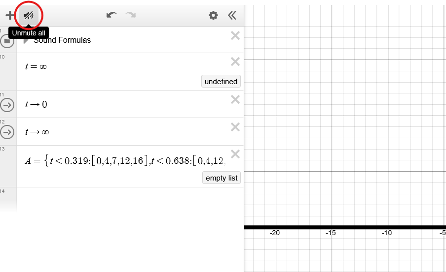

# Desmos MIDI Player

> A Rust-based CLI tool for converting MIDI files into formulas for Desmos. Complete with support for note velocity, tempo changes, and even custom soundfonts for different channels/instruments.

## Installation

To use the MIDI Player, you must have [Rust](https://www.rust-lang.org/tools/install) installed on your system.

### Prerequisites

**Windows:**
- No additional prerequisites

**Linux/WSL (Ubuntu/Debian):**
```bash
# Install X11 development libraries
sudo apt update
sudo apt install libxcb1-dev libxcb-render0-dev libxcb-shape0-dev libxcb-xfixes0-dev
```

**Other Linux distributions:**
- Equivalent X11 development packages for your package manager

### Building

Clone this repository and navigate to the directory:

```bash
git clone https://github.com/ruelalarcon/desmos_midi.git
cd desmos_midi
```

Then build the project using the provided script:

**Windows:**
```bash
./build.bat
```

**Linux/Mac:**
```bash
./build.sh
```
> Note: You may need to run `chmod +x *.sh` first to make the scripts executable if they aren't by default.

To clean build artifacts at any time, you can use:
```bash
./clean.bat  # Windows
./clean.sh   # Linux/Mac
```

## Usage

Navigate to [this Desmos graph](https://www.desmos.com/calculator/1rzq4xa5v0).

### Command Line Interface

**Basic Usage:**
```bash
./run.bat <midi_file>  # Windows
./run.sh <midi_file>   # Linux/Mac
```
> Note: From now on, we will use `.sh` for the rest of the examples, but if you are on Windows make sure to use the `.bat` versions instead.

**Advanced Usage:**
```bash
./run.sh <midi_file> -s <soundfont1> <soundfont2> ...  # Specify soundfonts for each channel
./run.sh <midi_file> -i                                # Show channel information
```

### Web Interface

For a more user-friendly experience, you can use the web interface:

```bash
./run_web.bat  # Windows
./run_web.sh   # Linux/Mac
```

This will start a local web server at http://localhost:3000 where you can:
1. Upload MIDI files
2. View channel information
3. Configure soundfonts for each channel
4. Convert to Desmos formula
5. Copy the formula to clipboard

The web interface is designed to be intuitive and provides a step-by-step workflow:

1. **Upload MIDI File**: Drag and drop or select a MIDI file
2. **Configure Soundfonts**: Choose soundfonts for each MIDI channel
3. **Get Desmos Formula**: Convert and copy the formula to use in Desmos

### Arguments (CLI)
- `<midi_file>`: Path to the input MIDI file to convert
- `-s, --soundfonts <FILES>`: Soundfont files to use for each channel (optional)
- `-i, --info`: Show MIDI channel information and exit
- `-c, --copy`: Copy output to clipboard instead of console

### Soundfonts
By default:
- Regular channels use `default` soundfont
- Drum channels (channel 10) are automatically ignored
- To include drum sounds or use different soundfonts, use the `-s` option and specify a soundfont for each channel
- Use `-` as a soundfont name to ignore that channel
- The `.txt` extension is optional for soundfont files - it will be added automatically if not specified

### Usage Examples

1. Basic conversion with default settings (drums ignored):
```bash
./run.sh song.mid
```

2. View channel information:
```bash
./run.sh song.mid -i
```

3. Specify custom soundfonts:
```bash
./run.sh song.mid -s default sine - default
```
This will use:
- `default.txt` for channel 1
- `sine.txt` for channel 2
- ignore channel 3
- `default.txt` for channel 4

4. Copy to clipboard instead of console output:
```bash
./run.sh song.mid -c
```

Now enable audio in Desmos through the button in the top left:


### Graph Controls

- To play the song, hit the arrow button to the left of the `t -> 0` formula.
- To end the song, hit the arrow button to the left of the `t -> ∞` formula.
- You may also set the value of `t` manually to seek to a specific point in the song.
- Open the "Settings" folder to adjust:
  - `velocity`: Animation phase speed
  - `scale`: Visual waveform amplitude
  - `hertz`: Base frequency (default 440Hz)
  - `detune`: The amount of detune applied to the secondary tone
  - `volume`: Global volume control
  - `transpose`: Global pitch shift in semitones

## Technical Details

### MIDI Processing

1. **MIDI Parsing**:
   - Uses the `midly` crate to parse MIDI files
   - Extracts note events (Note On/Off) and timing information
   - Handles tempo changes to ensure accurate timing
   - Preserves note velocities (0-127) for dynamic volume control
   - Properly tracks note durations for accurate playback

2. **Timing Conversion**:
   - Converts MIDI ticks to milliseconds using the formula:
     ```
     ms = (ticks * tempo) / (ticks_per_quarter * 1000)
     ```
   - Where:
     - `ticks`: MIDI event time in ticks
     - `tempo`: Microseconds per quarter note (default: 500000 = 120 BPM)
     - `ticks_per_quarter`: MIDI file's time division (ticks per quarter note)

3. **Note Processing**:
   - Tracks active notes and their velocities at each timestamp
   - Converts MIDI note numbers to relative positions from A (MIDI note 69 / 440 Hz)
   - Each note is paired with its velocity value and duration
   - Generates a Desmos piecewise function in the format:
     ```
     A=\left\{t<1:\left[0,100,0\right],t<2:\left[2,85,0\right],...\right\}
     ```
   - Where each note is represented by three values:
     - Semitones relative to A4 (440Hz)
     - Velocity (0-127)
     - Soundfont index

4. **Section Processing**:
   - If a MIDI file is too long for Desmos to parse, the program will automatically split it into sections
   - The sections are named `A_{1}`, `A_{2}`, etc.
   - The main `A` formula selects the appropriate section based on time

5. **Soundfont Processing**:
   - Soundfonts are stored in the `soundfonts/` directory and are text files containing comma-separated floating point values representing harmonic weights (weights for each frequency in the harmonic series, which can be used to generate a static waveform)
   - The `B` is a "list of lists" of harmonic weights, however, Desmos does not support nested lists so instead, the `C` value is the maximum size of the soundfont arrays (after padding) and we use that to index sublists in `B`

### Web Interface

The web interface is built using:
- **Backend**: Axum web framework (Rust)
- **Frontend**: HTML, CSS, and JavaScript
- **Features**:
  - File upload with drag-and-drop support
  - Dynamic soundfont selection
  - Real-time MIDI channel information
  - One-click formula copying

## Dependencies

- `midly`: MIDI file parsing
- `clipboard`: System clipboard integration
- `clap`: Command line argument parsing
- `axum`: Web server framework
- `tokio`: Asynchronous runtime
- `tower-http`: HTTP components for Tower

## Credits

- [Desmos](https://www.desmos.com/) for the formula visualization
- [Berrynote](https://www.youtube.com/@berrynote/videos) for the initial graph for playing notes on Desmos. [Berrynote's recent video](https://www.youtube.com/watch?v=g2Lp-gIa3es) was the inspiration and base for this project.

## Contributing

Contributions are welcome! Please feel free to submit a Pull Request.

## License

This project is licensed under the MIT License - see the LICENSE file for details.